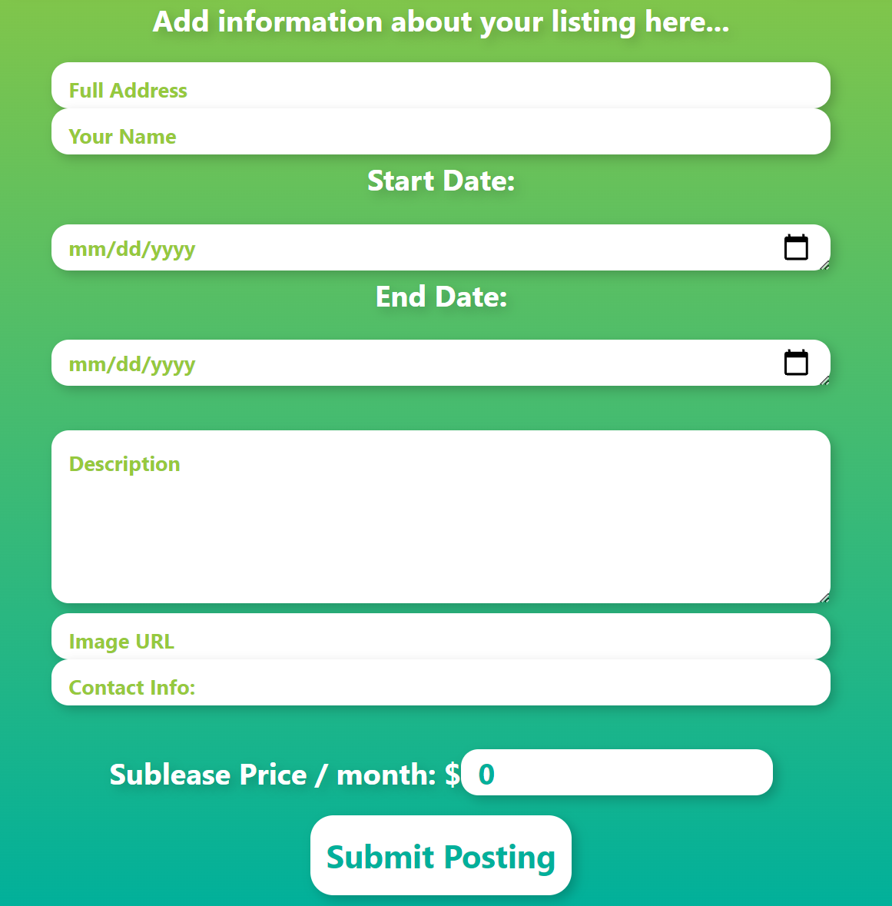
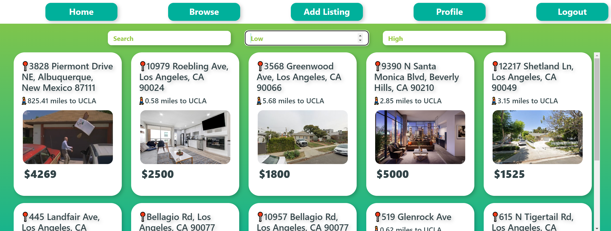

# Sublease Surfer

Sublease Surfer is a web application developed to facilitate the apartment subleasing/subletting process for college students. A detailed presentation of the application can be found [here](https://docs.google.com/presentation/d/1a_FD3G3iHuYh3M6AZVtshNhjGcXpqi1VH2AnFbN5FjA/edit?usp=sharing)

A [demo]() video will be linked later.

### Authors:
* Aaron Lee
* Kenzie MacDougal
* Michael Jiang
* Ethan Hui
* Jason Ye

## About
With the proliferation of a competitive housing situation in Westwood locally and beyond UCLA, Sublease Surfer aims to alleviate this issue. We aim to connect customers and subletter endpoints with everyday members of the community, so that students can more easily find housing in a college environment!

## Screenshots
The Front Page:

Add Listing Page:

The Edit Profile Page:

The page aggregating all posts

## Quick-start
1. Clone this repo by running `git clone https://github.com/aaron68lee/Sublease-Surfer.git`
2. Install necessary dependencies:
   * `npm install react-google-maps`
   * `npm install react-router-dom`
   * `npm install react-bootstrap`
   * `npm install firebase`
   * `npm install react-firebase-hooks`
   * `npm install react-images-uploading`
3. If installing fails due to dependency conflicts, pass `--force`.
4. Start the frontend: `cd ../frontend; npm start`
5. If `npm start` doesn't work, edit `package.json` react start-scripts with flag `"start": "react-scripts --openssl-legacy-provider-start"`
6. Visit the website at [localhost:3000](localhost:3000)

#### Misc Info:
* Frontend by default is hosted at [localhost:3000](http://localhost:3000)

## Git How-to Guide:
#### Cloning A Repo:
1. `cd` into the folder you want to clone (aka download) this repo to
2. Run the command `git clone https://github.com/aaron68lee/Sublease-Surfer` (Note that you will need git installed on your machine)

#### Adding Contributions:
1. Make a branch. To make a branch, run `git branch [NAME OF THE BRANCH]`
2. Type your code/contributions
3. Once your done, you want to `stage` your changes, by running `git add [FILES THAT YOU WANT TO ADD]`
4. Make a commit: `git commit -m [DESCRIPTION OF YOUR CHANGES]`
5. Push these changes to the server: `git push origin HEAD`
6. Go to [GitHub](https://github.com/aaron68lee/Sublease-Surfer) and open a Pull Request.
7. Wait for a code review, and if everything looks good, we'll see your contributions onto the main branch!

Thanks for the help!

#### Useful commands
* Add every file: `git add -A`
* Switch between branches: `git checkout [NAME OF THE BRANCH]`
* Get updates from the server: `git pull`
* List branches: `git branch`
* [For other commands, reference here](https://git-scm.com/doc)

## Special Thanks
* TAs
* Professor Eggert

